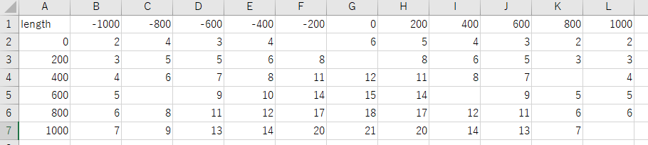
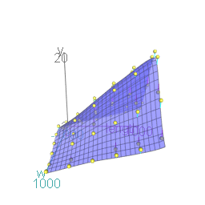
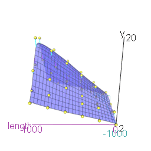

```{r setup, include=FALSE}
knitr::opts_chunk$set(echo = TRUE,error=FALSE,message= FALSE,warning = FALSE)

```
特殊なデータの整形から3dグラフまでの流れ

## 数字名因子のデータ読み込み
因子名が数字となっている場合:数字の頭にXがつく
およびマイナスが含むcsvを数字に変える



```{r data}
Dir <- getwd()
Dataset <- read.csv("test3d.csv")
#Dataset <- read.csv(file.choose()) ダイアログからファイル開くときはこちら
knitr::kable(head(Dataset))

```

## 必要なライブラリ
```{r library}
library(reshape2)
library(rgl)
library(scatterplot3d)
library(mgcv)
library(car)
```

## reshape&replace  
  
replaceをひとつずつ場合はこちらを全て実行  
d["variable"] <- lapply(d["variable"],gsub,pattern="X200",replacement="200")  
d["variable"] <- lapply(d["variable"],gsub,pattern="X400",replacement="400")  
d["variable"] <- lapply(d["variable"],gsub,pattern="X600",replacement="600")  
d["variable"] <- lapply(d["variable"],gsub,pattern="X800",replacement="800")  
d["variable"] <- lapply(d["variable"],gsub,pattern="X1000",replacement="1000")  
d["variable"] <- lapply(d["variable"],gsub,pattern="X.200",replacement="-200")  
d["variable"] <- lapply(d["variable"],gsub,pattern="X.400",replacement="-400")  
d["variable"] <- lapply(d["variable"],gsub,pattern="X.600",replacement="-600")  
d["variable"] <- lapply(d["variable"],gsub,pattern="X.800",replacement="-800")  
d["variable"] <- lapply(d["variable"],gsub,pattern="X.1000",replacement="-1000") 
</font>
```{r reshape}
#データをreshape
d <- melt(Dataset,id="length")
knitr::kable(head(d))
```

```{r replace}
#Xがつく要素をまとめて変換
#「.」は正規表現のため、\\.で.扱いにする。
d["variable"] <- sapply(d["variable"],gsub,pattern="X\\.",replacement="-")
d["variable"] <- sapply(d["variable"],gsub,pattern="X",replacement="")
knitr::kable(head(d))
```

## 型が文字列characterになっているので数値numericにする
```{r}
d$variable <- as.numeric(d$variable)
```

## データフレーム化,NAを除く
```{r}
d2 <- data.frame(d)
d2 <-na.omit(d2)
knitr::kable(head(d2))
```

## マウスで動くプロット作成
```{r plot1}
scatter3d(value~length+variable, 
          data=d2,fit="smooth", 
          residuals=TRUE, 
          bg="white", 
          axis.scales=TRUE, 
          grid=TRUE, 
          ellipsoid=FALSE,xlab="length",ylab="y",zlab="w")
rgl.snapshot("plot1.png")
```



## 自動的に回転するプロット

scatter3d(value~length+variable,  
          data=d2,fit="smooth",  
          residuals=TRUE,  
          bg="white",  
          axis.scales=TRUE,  
          grid=TRUE,  
          ellipsoid=FALSE, 
          xlab="length",  
          ylab="y",  
          zlab="w")  
play3d(spin3d(axis = c(0, 1, 0), rpm = 3), duration = 10 )  

movie3d(  
  movie="3dAnimatedScatterplot",  
  spin3d( axis = c(0, 1, 0), rpm = 3),  
  duration = 10,  
  dir = Dir,  
  type = "gif",  
  clean = TRUE  
)  
  
上記で連続してコマンドすればアニメーションgifが出力される  
  


Memo:  
列名変更したい場合。  
左が変えたあと、みぎがかえるまえ  
#d2 <- rename(d2, y = value)
